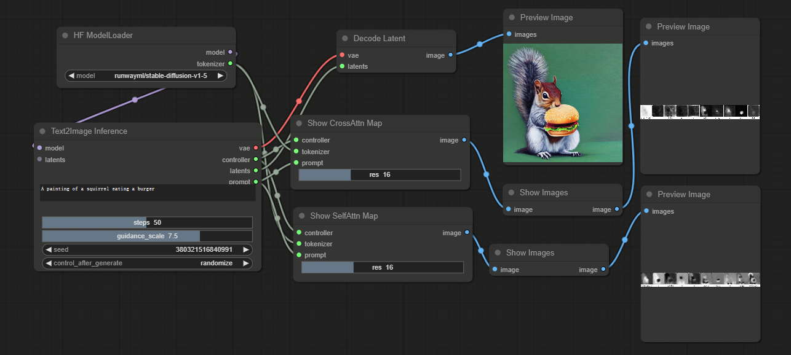

# ComfyUI nodes to use VisualAttentionMap

https://github.com/google/prompt-to-prompt

## Install

- 推荐使用管理器 ComfyUI Manager 安装（On the Way）

- 手动安装：
    1. `cd custom_nodes`
    2. `git clone https://github.com/leeguandong/ComfyUI_VisualAttentionMap.git`
    3. 重启 ComfyUI

## Use

- 节点：
    - HF ModelLoader: 加载hf格式的模型权重
    - Text2Image Inference: 推理，并保存了attention map
    - Decode Latent: VAE解码
    - Show Images: 展示attention map
    - Show CrossAttn Map: 把cross attention map取出来
    - Show SelfAttn Map: 把self attention map取出来

## Stars

